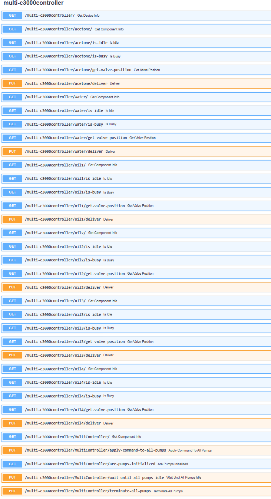

# Adding a New Device as an External Plugin

Flowchem supports external plugins, allowing users to create local packages that extend its functionalities. This 
approach offers several advantages, such as maintaining full control over device-specific code. However, it introduces 
additional complexity and is recommended only for experienced Python developers.

Flowchem uses Python [entry points](https://packaging.python.org/en/latest/specifications/entry-points/) 
to automatically discover installed plugins. To be recognized by Flowchem, any new 
plugin must register an entry point under the flowchem.devices group.

## Getting Started

You can start by forking the `flowchem-test` repository, which provides a template for a Flowchem plugin.
Configuration with pyproject.toml

If you are using a pyproject.toml file, the configuration should look something like this:

```toml
[project.entry-points."flowchem.devices"]
test-device = "flowchem_test:fakedevice"
```

## Example: Integrating a Real Device Library

Let's walk through an example of integrating an existing library into Flowchem. We will use the 
[pycont](https://github.com/croningp/pycont) library, developed to control Tricontinent C3000 pumps. 

The `pycont` package contains two main classes, defined in 
[controller.py](https://github.com/croningp/pycont/blob/master/pycont/controller.py#L338):

* `VirtualC3000Controller`: Handles communication with individual pumps.

* `MultiPumpController`: Manages multiple pumps simultaneously.

To integrate this library into Flowchem, follow these steps:

### Step 1: Fork the library 

Fork the `pycont` repository so you can modify it to fit the Flowchem plugin architecture.

### Step 2: Add an Entry Point

Add an entry point to the `setup.py` file to make Flowchem recognize the device:

```python
from setuptools import find_packages, setup

VERSION = '1.0.2'

setup(
    name="pycont",
    version=VERSION,
    description="Tools to work with Tricontinental Pumps",
    author="Jonathan Grizou",
    author_email='jonathan.grizou@glasgow.ac.uk',
    packages=find_packages(),
    package_data={
        "pycont": ["py.typed"]
    },
    include_package_data=True,
    install_requires=['pyserial'],
    entry_points={
        "flowchem.devices": [
            "multi-c3000controller = pycont._flowchem_plugin"
        ],
    },
)
```
[!NOTE]
Your fork of the `pycont` package must be installed in the same environment where flowchem is installed.

### Step 3: Create a Flowchem-Compatible Plugin Module

Next, create a module that contains two classes to integrate with Flowchem. The classes are structured to adapt the 
original library`s methods to work within Flowchem's asynchronous framework.

Create the plugin module file `_flowchem_plugin.py` inside the `pycont` directory, as specified in the entry point.

#### Example: Plugin Module

```python
from flowchem.components.flowchem_component import FlowchemComponent
from flowchem.devices.flowchem_device import DeviceInfo, FlowchemDevice

from pycont.controller import VirtualC3000Controller, VirtualMultiPumpController


class APIMultiPumpController(FlowchemDevice):

    device_info = DeviceInfo(
        manufacturer="virtual-device",
        model="FakeDevice",
        serial_number=42,
        version="v1.0",
    )

    def __init__(self, name: str, configuration: str):
        super().__init__(name)
        self.configuration = configuration
        self.controller: VirtualMultiPumpController | None = None

    async def initialize(self):
        """Initialize the device and add its components."""
        self.controller = VirtualMultiPumpController.from_configfile(self.configuration)

        for name in self.controller.pumps.keys():
            self.components.append(PumpComponent(name=name, hw_device=self))

        self.components.append(MultiPumpComponent(name="MultiController", hw_device=self))


class PumpComponent(FlowchemComponent):

    hw_device: APIMultiPumpController

    def __init__(self, name: str, hw_device: APIMultiPumpController):
        super().__init__(name, hw_device)
        self.pump: VirtualC3000Controller = self.hw_device.controller.pumps[name]

        # Expose device methods via FastAPI endpoints
        self.add_api_route("/is-idle", self.is_idle, methods=["GET"])
        self.add_api_route("/is-busy", self.is_busy, methods=["GET"])
        self.add_api_route("/get-valve-position", self.get_valve_position, methods=["GET"])
        self.add_api_route("/deliver", self.deliver, methods=["PUT"])

    async def is_idle(self):
        return self.pump.is_idle()

    async def is_busy(self):
        return self.pump.is_busy()

    async def get_valve_position(self):
        return self.pump.get_valve_position()

    async def deliver(self, volume_in_ml: float, to_valve: str | None = None, speed_out: int | None = None, 
                      wait: bool = False, secure: bool = True):
        return self.pump.deliver(volume_in_ml, to_valve, speed_out, wait, secure)


class MultiPumpComponent(FlowchemComponent):

    hw_device: APIMultiPumpController

    def __init__(self, name: str, hw_device: APIMultiPumpController):
        super().__init__(name, hw_device)

        # Expose multi-pump methods via FastAPI endpoints
        self.add_api_route("/apply-command-to-all-pumps", self.apply_command_to_all_pumps, methods=["PUT"])
        self.add_api_route("/are-pumps-initialized", self.are_pumps_initialized, methods=["GET"])
        self.add_api_route("/wait-until-all-pumps-idle", self.wait_until_all_pumps_idle, methods=["PUT"])
        self.add_api_route("/terminate-all-pumps", self.terminate_all_pumps, methods=["PUT"])

    async def apply_command_to_all_pumps(self, command: str, *args, **kwargs):
        return self.hw_device.controller.apply_command_to_all_pumps(command, *args, **kwargs)

    async def are_pumps_initialized(self) -> bool:
        return self.hw_device.controller.are_pumps_initialized()

    async def wait_until_all_pumps_idle(self):
        return self.hw_device.controller.wait_until_all_pumps_idle()

    async def terminate_all_pumps(self):
        return self.hw_device.controller.terminate_all_pumps()
```
[!NOTE]
For more information on why you need to import FlowchemComponent and FlowchemDevice, refer to the guide on
[how to add new devices (straight approach)](add_to_flowchem.md).

[!NOTE]
For detailed documentation on device behavior and communication, visit the `pycont` 
[documentation](https://github.com/croningp/pycont/blob/master/README.md).

### Step 4: Add Configuration

Finally, create a configuration file that specifies the device initialization.

Example configuration (config.toml):

```toml
[device.multi-c3000controller]
type = "APIMultiPumpController"
configuration = ".../pycont/tests/pump_multihub_config.json" # Path to the configuration file. See the pycont repo for more details.
```

## Result

By following these steps, the capabilities of your devices will be automatically exposed through the Flowchem server,
similar to the native devices already present in Flowchem.

