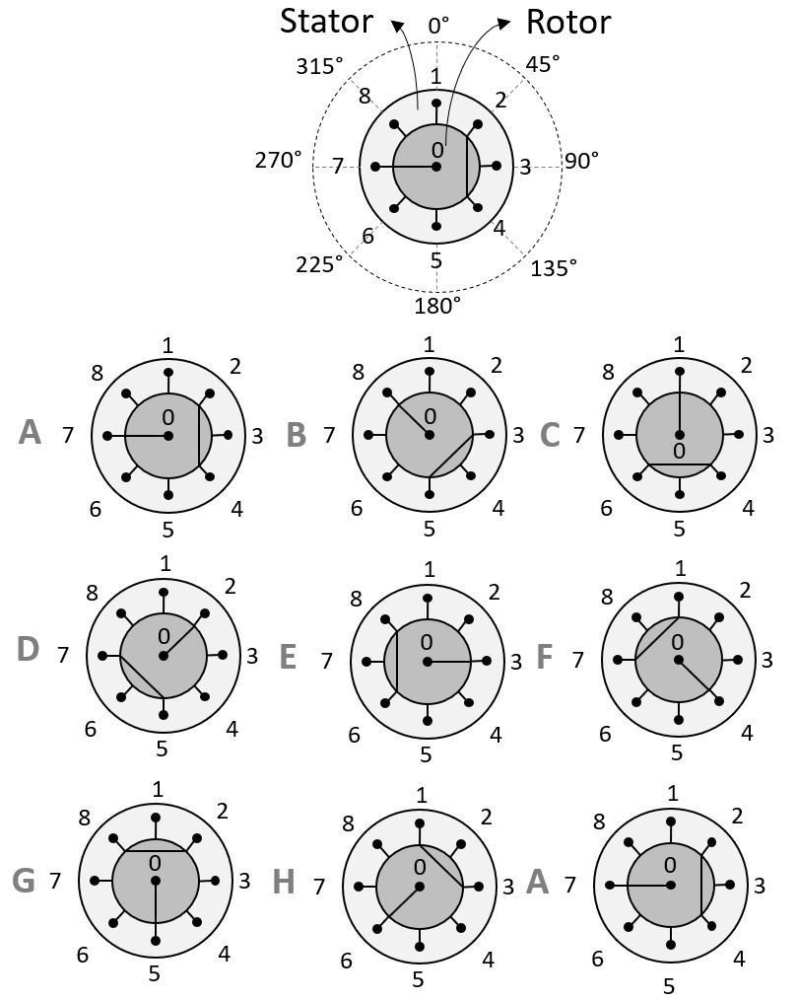
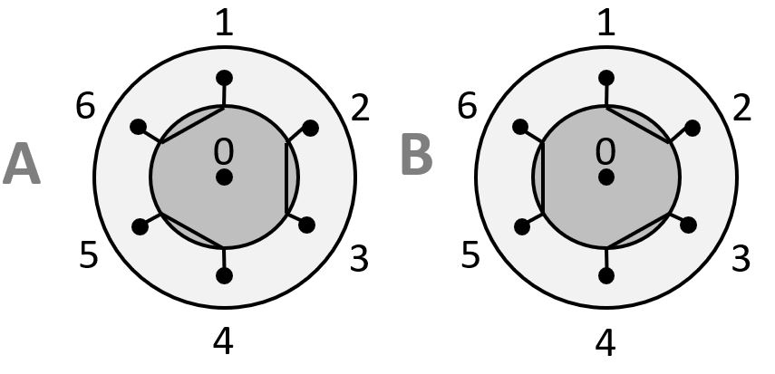

# Valve logic implemented

This section is specially built for some users who want to add new valves to the package devices. As the valve is the 
most complex device implemented in the package, it is essential to understand the logic before adding devices of the 
same kind.

The valve logic, or better specifically, the rotary valve logic, is based on the device's movement and degree of 
freedom. The figure above illustrates an example of a valve well. The rotary valve has 2 parts. 
The first part, called stator, is fixed. There, the tubes are connected. The second part, 
called the rotor, is mobile. The rotor can rotate to a specific angle to reach a connection configuration. 

In the figure, the systematic numbering of the 9 ports, from 0 to 8, ensures a clear understanding of their relation to 
the central port. The first port, number 1, is always the highest, and the subsequent ports are numbered in a clockwise
direction.



Two lists are essential to creating the map of the connection according to the rotor and stator. The `stator_ports` 
is the list of the available connection ports. The `rotor_ports` is the list of mappings for the connected port. The example above corresponds to position A illustrated in the figure.

```python
stator_ports=[(1, 2, 3, 4, 5, 6, 7, 8), (0,)],
rotor_ports=[(None, None, 10, None, 10, None, 9, None), (9,)]
```

Observe that the second element of both lists correlates with the central port address as number zero. The 
`rotor_ports` states that ports 3 and 5 and 7 and 0 are connected.

```python
stator_ports=[(1, 2, 3, 4, 5, 6, 7, 8), (0,)],
rotor_ports=[(None, None, None, 10, None, 10, None, 9), (9,)]
```
Following the logic, with a rotation of +45 degrees in the rotor, only the `rotor_ports` is shifted. Then, the 
new configuration, or position B, as illustrated in the figure, will be:

```python
stator_ports=[(1, 2, 3, 4, 5, 6, 7, 8), (0,)],
rotor_ports=[(9, None, None, None, 10, None, 10, None), (9,)]
```
Position C will be:

```python
stator_ports=[(1, 2, 3, 4, 5, 6, 7, 8), (0,)],
rotor_ports=[(None, 9, None, None, None, 10, None, 10), (9,)]
```
Imagine if we have a distribution valve with 2 positions and 6 ports, as shown above.



The configuration of this two position, according to the logic, will be:

For position A:
```python
stator_ports=[(1, 2, 3, 4, 5, 6), (None,)],
rotor_ports=[(7, 8, 8, 9, 9, 7), (None,)]
```

For position B:
```python
stator_ports=[(1, 2, 3, 4, 5, 6), (None,)],
rotor_ports=[(7, 7, 8, 8, 9, 9), (None,)]
```