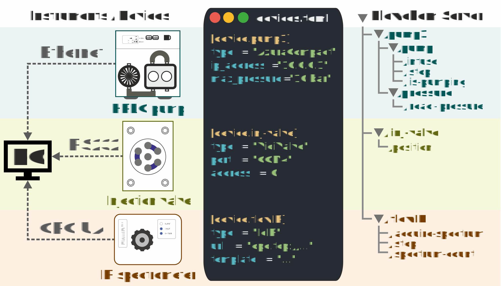

# Flowchem

Flowchem is an application to simplify the control of instruments and devices commonly found in chemistry labs.
Flowchem acts as unifying layer exposing devices using different command syntax and protocols under a single API.

In a typical scenario, flowchem:
1. reads a configuration file listing the devices to be controlled and their settings;
2. creates connections with each device and ensures a reproducible state at start-up;
3. provides access to the capabilities of each device (such as pumping, heating etc...) via a web interface.



Since flowchem leverages web technologies, flowchem devices can be controlled directly with a web browser or by clients
written in different languages and from almost any operative system, including Android and iOS.
A set of python clients interfacing with the flowchem API are also provided and used in examples.

::::{grid} 1 2 3 4

:::{grid-item}
:columns: 1

```{button-ref} getting_started
:color: primary
```
:::
:::{grid-item}
:columns: 1

```{button-ref} Tutorial
:color: secondary
```
:::
:::{grid-item}
:columns: 1

```{button-ref} Examples
:color: secondary
```
:::
:::{grid-item}
:columns: 1

```{button-ref} api/index
:color: secondary
```
:::
::::
---

## Install flowchem
To install `flowchem`, ensure you have Python installed, then run:
```shell
pip install flowchem
```
More information on [installing flowchem](./getting_started.md).

---

## Tutorial
Follow the [Introduction tutorial]() for a hands-on introduction to flowchem:

```toml
[device.example1]
type="FakeDevice"
```
```{button-ref} ./examples/hallo-world
:color: primary
```
---

<!--
TODO: add ref to paper once out.
## Citation
If you use flowchem for your paper, please remember to cite it!
-->

```{toctree}
:maxdepth: 2
:hidden:

getting_started

learning/index

devices/supported_devices

api/index

contribute

add_device/index

```
