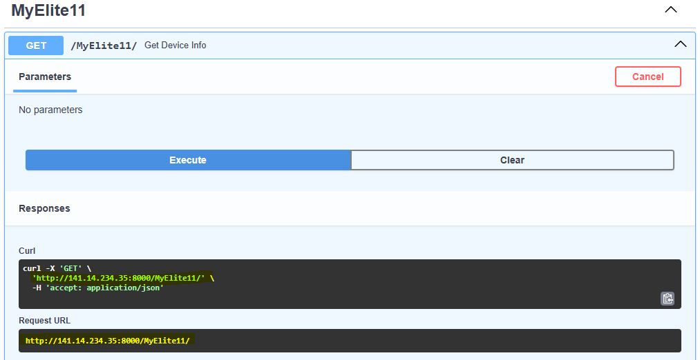
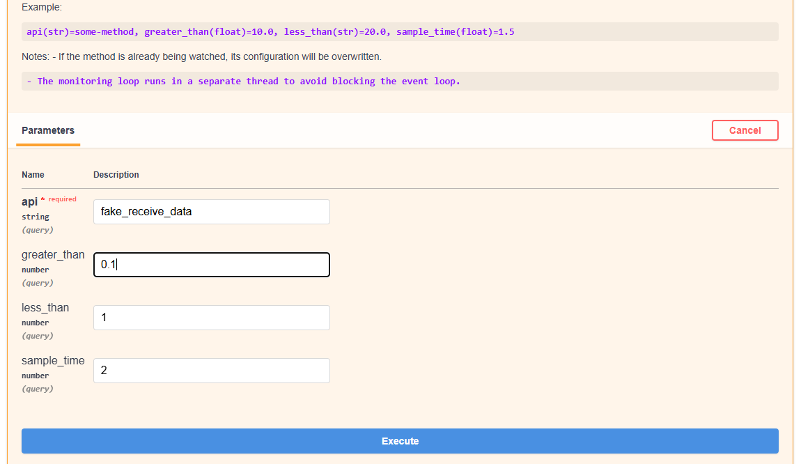

# Tools

There are additional tools in flowchem to help users create the configuration file and utilize the API server.

## Autodiscover

Some devices implemented in flowchem can be discovered using the autodiscover function present in flowchem. To activate
this function, simply type the command in the command window.

```shell
flowchem-autodiscover
```
Autodiscover will examine the local network using Zeroconf service discovery to verify if there are any devices 
connected through Ethernet. Additionally, it will search for devices connected through serial connections based on 
the user's preferences.

```{warning}
The autodiscover include modules that involve communication over serial ports. These modules are *not* guaranteed to be
 safe. Unsupported devices could be placed in an unsafe state as result of the discovery process!
```

After the examination, a configuration file will be generated with the main characteristics of each identified device.
This feature saves time when creating the configuration file. The file named `flowchem_config.toml` created is placed 
in the flowchem package folder

```{note}
Some additional information is generally still necessary even for auto-detected devices.
```

Complete the missing information (if any) in this file, and then you will be ready to use flowchem!

```{note}
`flowchem_config.toml` is written in [TOML format](https://en.wikipedia.org/wiki/TOML),
the syntax of this language is intuitive and designed to be human-editable.
If you follow this guide you will not need to learn anything about the TOML syntax, but you can just copy and modify the
examples provided.
```

:::{note}
Not all the devices supported by flowchem can be auto discovered, so you might need to edit the configuration
file manually for some device types.
:::

## Accessing API

This function searches for flowchem devices on the network and returns a dictionary where the keys are device names
and values are API devices instances.

```python
from flowchem.client.client import get_all_flowchem_devices

devices = get_all_flowchem_devices()
```

This variable `devices` can be referred to as "client," as it is a client built on top of flowchem that utilizes its 
functionalities.

In a similar way that you can access the functionalities of the devices through the API, you can use the client devices.
For example, if you have an Elite11 pump, called *pumpG*, running on flowchem, you can send an infuse command to the 
pump 
with a volume 
of 10 ml and a flow rate of 1 ml/min through the API in the browser.


With the client `devices`, this can be done in Python. Using the client `devices`, the construction of protocols directly 
in Python is facilitated.

```python
from flowchem.client.client import get_all_flowchem_devices

devices = get_all_flowchem_devices()

devices["PumpG"]["pump"].put("infuse", {"volume": "10 ml", "rate": "1 ml/min"})
```

The example shown in section [example](examples/reaction_optimization.md) presents one way of how the 
protocols can be constructed.

### Direct approach

To efficiently discover devices exposed by a FlowChem server—especially when dealing with a large number of devices or multiple servers on the intranet—we recommend using the direct approach. In this approach, the user manually provides the IP address (or URL) of the desired server.

This address can be obtained from the FastAPI web interface (see illustration below).


Figure: Accessing the server URL via FastAPI interface

Once the address is known, the function below (get_flowchem_devices_from_url) can be used to create clients for each available device on the server:

```python
from flowchem.client.client import get_flowchem_devices_from_url

devices = get_flowchem_devices_from_url(url="http://141.14.234.35:8000/")

devices["PumpG"]["pump"].put("infuse", {"volume": "10 ml", "rate": "1 ml/min"})
```

This function queries the OpenAPI specification exposed by the server and returns a dictionary of initialized FlowchemDeviceClient instances, each corresponding to one device.

## Virtual devices

If the user does not have electronic devices available to initialize Flowchem, a practical approach is to use 
virtual devices for testing.

Flowchem provides a digital twin version for every implemented device. This means that, for example, if the user 
wants to test a device with a configuration described as follows:

```toml
[device.my-realdevice]
type = "PeltierCooler"
port = "COM12"
address = 0
```

Simply change the device type by prefixing the name with "Virtual":

```toml
[device.my-realdevice]
type = "VirtualPeltierCooler"
port = "COM12"
address = 0
```

This functionality is intended for educational purposes, allowing users to explore how the package works without 
requiring a physical device to be connected.

The file containing all available virtual devices can be found 
[here](../../tests/virtualdevices.toml). To run this file, simply type the following 
command in your terminal:

```local
flowchem tests/virtualdevices.toml
```

## Watch-Dog Approach

This approach is designed to monitor specified methods' outputs and check their values against defined conditions. The 
class exposes two main API endpoints to control the monitoring process:

* PUT /watch: Starts watching a method with specified conditions.

* PUT /stop-watch: Stops all active monitoring.

The Watch-Dog approach is built to observe the output of specific methods at a set interval (`sample_time`) and check if 
the returned value exceeds or falls below predefined thresholds (`greater_than` or `less_than`). If the value violates 
the set conditions, an error is logged. This feactures is access through a API methods as shown bellow:


The monitoring process runs in a separate thread to ensure non-blocking behavior, allowing the main application to 
continue operating smoothly.

### Endpoints

* PUT /watch

Description:
Starts monitoring a method's output based on the specified conditions.

Parameters:

1 - api (str, required): The method name or API route to watch.

2 - greater_than (float, optional): Triggers an alert if the value is greater than this threshold.

3 - less_than (float, optional): Triggers an alert if the value is less than this threshold.

4 - sample_time (float, optional): Interval in seconds for checking the value. Default is `2.0` seconds.

* PUT /stop-watch

Description:
Stops the monitoring loop for all watched methods.

### Example

If the device, especially sensors, has a `GET` endpoint called `fake_receive_data` and you want to analyze this variable 
every 2 seconds to check if its value remains between `0.1` and `1`, you can configure it as shown below:



Notes to developers

* Monitoring runs in a separate thread to avoid blocking the event loop. 
* Multiple methods can be watched simultaneously.
* If a method is not found, an error is logged.
* If the method's return value violates the defined conditions, an error is logged with the details.

## Logging's

Logging Configuration

To set the logging folder, use the `--log` option followed by the desired file path.

Example:

```shell
python -m flowchem example --log logs/flowchem.log
```
If --log is specified, all logs are saved to the file in DEBUG level.

If not specified, logs are printed to the console in INFO level.

In debug mode (-d), logs are more detailed and include debugging information.

Example Usage

* Run Flowchem with a simulated device with logging enabled:

```shell
python -m flowchem example --log /path/to/logs/flowchem.log
```

Logging Details

The logging file records all information flow related to `GET` and `PUT` endpoint triggers on the API server. It includes:

* The date and time of each request.

* Relevant information about the request, such as the endpoint accessed, parameters used, and response status.

This helps in monitoring the system's behavior and debugging potential issues.

Example of a log entry:

```text
2025-02-20 13:57:12.989 | DEBUG    | flowchem.__main__:main:69 - Starting server with configuration file: 'flowchem\examples/FakeDevice_configuration.toml'
2025-02-20 13:57:12.989 | INFO     | flowchem.server.zeroconf_server:__init__:32 - Zeroconf server up, broadcasting on IPs: ['141.14.233.161']
2025-02-20 13:57:12.989 | DEBUG    | flowchem.server.fastapi_server:__init__:32 - HTTP ASGI server app created
2025-02-20 13:57:13.005 | DEBUG    | flowchem.devices.list_known_device_type:_autodiscover_devices_in_module:26 - Found 22 device type(s) in flowchem.devices
2025-02-20 13:57:13.074 | DEBUG    | flowchem.devices.list_known_device_type:_autodiscover_devices_in_module:26 - Found 1 device type(s) in flowchem_test.fakedevice
2025-02-20 13:57:13.074 | DEBUG    | flowchem.server.configuration_parser:parse_device:141 - Created 'fake-device' instance: FakeDeviceExample
2025-02-20 13:57:13.074 | INFO     | flowchem.server.core:setup:85 - Initializing device connection(s)...
2025-02-20 13:57:13.074 | INFO     | flowchem.devices.fakedevice.fakedevice:initialize:28 - FakeDevice devices was successfully initialized!
2025-02-20 13:57:13.074 | DEBUG    | flowchem.components.flowchem_component:add_api_route:102 - Adding route / for router of FakeComponent
2025-02-20 13:57:13.074 | DEBUG    | flowchem.components.flowchem_component:add_api_route:102 - Adding route /watch for router of FakeComponent
...
```